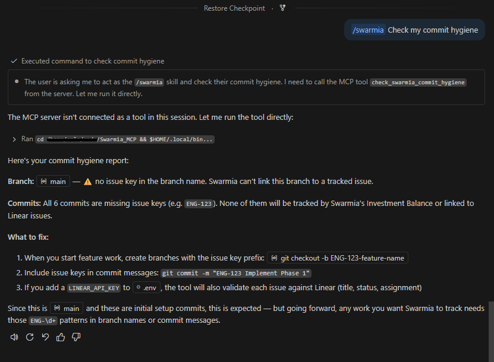
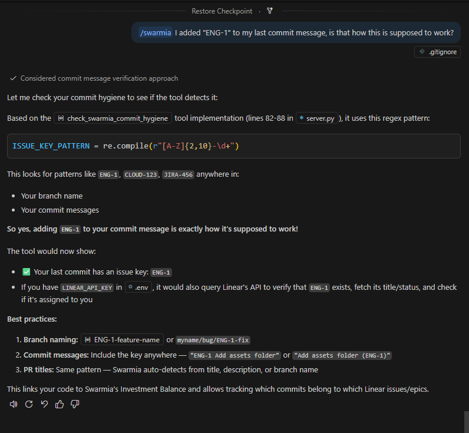
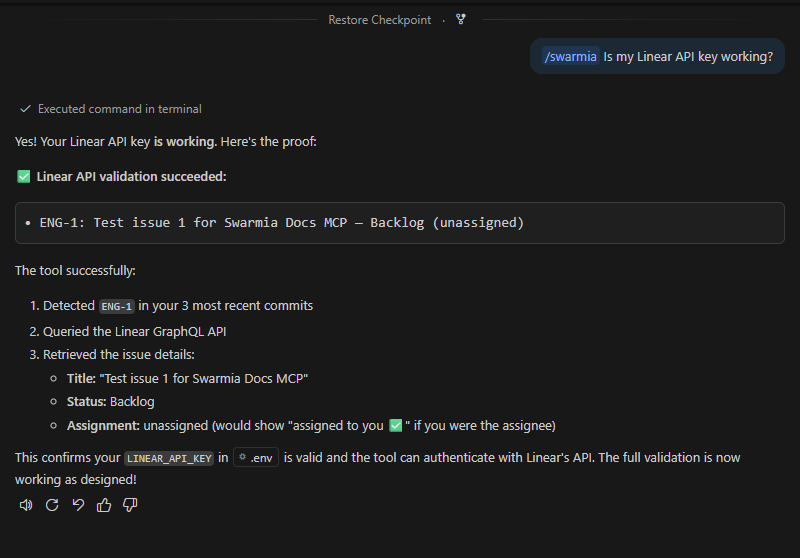
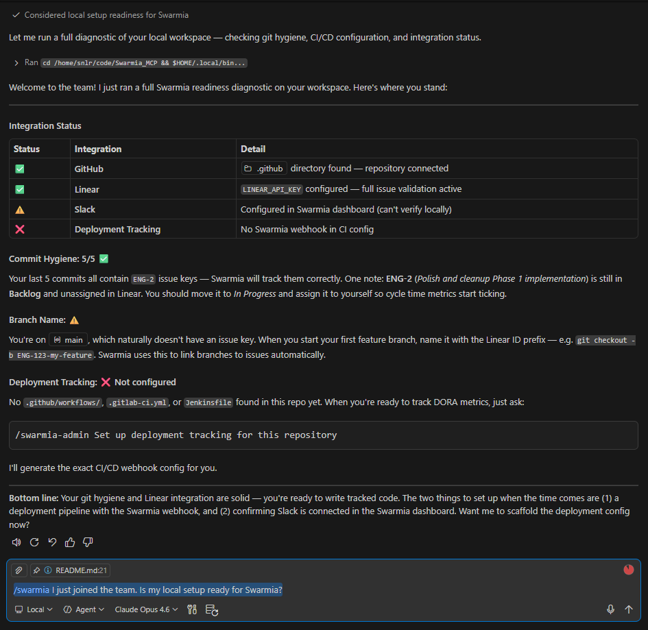

# Swarmia Docs MCP

**Active documentation for Swarmia &ndash; directly in your IDE**

[Static knowledge bases are dead](https://www.reddit.com/r/SaaS/comments/1q86tzp/the_concept_of_static_knowledge_bases_is_dying/). Developer tooling grows increasingly complex &ndash; and traditional knowledge bases are not cutting it. **Today,** when developers face integration or troubleshooting issues with platforms like Swarmia, they are forced to break their workflow, context-switch to a web browser, click through documentation. This traditional "pull" model of support relies entirely on the developer to find instructions and translate them into their specific local environment. It's **slow, inefficient, and highlights the need for documentation that converges with tooling.**

**This project** introduces a singular Skill, backed by a custom MCP Server. You shift gears: from static documentation to interactive workflow. **Invoke `/swarmia`** directly within your IDE. The MCP server actively assesses your local environment &ndash; git history, branch names, CI/CD configuration &ndash; and provides actionable solutions:

* **Check commit hygiene** &ndash; verify branches and commits contain issue tracker IDs, validate against Linear API
* **Scaffold deployment tracking** &ndash; detect your CI/CD framework and generate Swarmia webhook config
* **Answer Swarmia questions** &ndash; query bundled documentation contextually, no browser needed

## Scenario 1: 

| I'm unsure what to do. <br>``/swarmia`` shows me what to fix: | It works. | Is my Linear API key ok? <br>Let's check: |
| :---: | :----: | :---: |
| <kbd></kbd> | <kbd></kbd> | <kbd></kbd> |

## Scenario 2: 

| /swarmia I just joined the team. <br>Is my local setup ready? | Something | Something |
| :---: | :----: | :---: |
| <kbd></kbd> | <kbd>img</kbd> | <kbd>img</kbd> |


# Usage

TO DO: sort by IDE, currently VS Code only.

### 1. Prerequisites

```bash
# Install uv (if not already installed)
curl -LsSf https://astral.sh/uv/install.sh | sh

# Optional: add a Linear API key for full issue validation
echo 'LINEAR_API_KEY=lin_api_yourkey' > .env
```

### 2. Add the MCP server to your project

Add `.vscode/mcp.json` to your project. It tells VS Code how to start the MCP server.

**Option A — Install from GitHub (recommended for your project):**

```json
{
  "servers": {
    "swarmia": {
      "type": "stdio",
      "command": "uvx",
      "args": ["--from", "git+https://github.com/YOUR_ORG/Swarmia_MCP", "swarmia-mcp"],
      "envFile": "${workspaceFolder}/.env"
    }
  }
}
```

`uvx` fetches the package directly from GitHub, builds it in an isolated environment, and runs the `swarmia-mcp` entry point. No cloning required &mdash; just commit this `mcp.json` to your repo and every developer gets the server automatically.

**Option B — Local development (of this repo):**

```json
{
  "servers": {
    "swarmia": {
      "type": "stdio",
      "command": "uv",
      "args": ["run", "python", "-m", "swarmia_mcp"]
    }
  }
}
```

When you invoke `/swarmia` in the chat, VS Code spawns the server as a child process and connects to it over stdio. No manual server startup needed &ndash; `uv` resolves dependencies and creates an isolated environment on first run.


### 3. IDE Skills

Two Skills route your intent to the right tools:

| Skill | Persona | When to use |
|---|---|---|
| `/swarmia` | Developer pair programmer | Troubleshooting, checking branch/commit hygiene, general Swarmia questions |
| `/swarmia-admin` | Infrastructure engineer | Setting up deployment pipelines, configuring DORA metrics, initial integration |

> The `/swarmia` and `/swarmia-admin` **Skills are not installed automatically** with the MCP server. Copy the `.github/skills/swarmia/` and `.github/skills/swarmia-admin/` directories from this repository into your project's `.github/skills/` folder. Without these Skills, the MCP tools still work &ndash; but your LLM won't have the persona and routing instructions that make `/swarmia` invocations work.

### 4. Use `/swarmia` in the chat

Type `/swarmia` followed by your question or request. The LLM routes your intent to the right tool.

### Manual testing (optional)

For debugging or testing outside VS Code, run the server directly:

```bash
uv run python -m swarmia_mcp
```

Or use MCP Inspector to call tools interactively:

```bash
npx @modelcontextprotocol/inspector uv run python -m swarmia_mcp
```


### Example interactions

**Check if your branch will be tracked by Swarmia:**
```
/swarmia Is my current branch going to be tracked properly?
```
> Agent checks your local git &ndash; notices `fix-bug` lacks an `ENG-` prefix &ndash; replies:
> *"Your branch is missing a Linear ID. Shall I rename it to `ENG-XXX-fix-bug`?"*

**Audit recent commits for issue keys:**
```
/swarmia Check my last 5 commits for Swarmia compliance
```
> Agent calls `check_swarmia_commit_hygiene` &ndash; scans commit messages for `ENG-\d+` patterns &ndash; flags any missing issue keys and offers to help fix them via interactive rebase.

**Set up DORA metrics / deployment tracking:**
```
/swarmia-admin Set up deployment tracking for this repository
```
> Agent calls `scaffold_swarmia_deployment` &ndash; detects GitHub Actions (or GitLab CI, Jenkins) &ndash; generates the exact webhook YAML and explains which secrets to add.

**Ask a Swarmia question without leaving the IDE:**
```
/swarmia How does Swarmia calculate Cycle Time?
```
> Agent queries bundled documentation and returns a concise answer (max 3 sentences) grounded in official Swarmia help center content.

**Check why work isn't showing up in Investment Balance:**
```
/swarmia Why isn't my current work showing up in the Investment Balance view?
```
> Agent chains tools: checks your git history for missing issue keys, then explains that Swarmia requires PR&ndash;issue linking to categorize work into investment categories.


---

# Video

include screencast

# Details

## Architecture

```
IDE (VS Code)
  ├── /swarmia          (Skill — developer persona)
  ├── /swarmia-admin    (Skill — infra persona)
  └── LLM routes intent
        ↓
  swarmia_mcp/server.py (FastMCP, stdio transport)
    ├── check_swarmia_commit_hygiene  →  local git + Linear API  →  ui://commit-hygiene.html
    ├── scaffold_swarmia_deployment   →  filesystem scan + YAML   →  ui://deployment-scaffold.html
    └── query_swarmia_docs            →  bundled docs + diagnostics → ui://docs-diagnostic.html
```

**Transport:** stdio (zero-latency local process). The server runs as a child process of the IDE &mdash; no network ports, no Docker.

**MCP Apps:** Each tool declares a `ui://` resource via FastMCP's native `AppConfig`. The host (VS Code) fetches self-contained HTML via `resources/read` and renders it inline. No HTTP server needed &mdash; widget HTML with inlined React bundles is served directly over the MCP protocol.

**Distribution:** Installable Python package. Use `uvx --from git+https://github.com/V-You/Swarmia_MCP swarmia-mcp` to install from GitHub without cloning, or `uv run python -m swarmia_mcp` for local development.

## Tools

### `check_swarmia_commit_hygiene`
Reads local `git log` and `git branch`, regex-scans for issue tracker IDs (e.g. `ENG-123`), and optionally validates each issue against the Linear GraphQL API. Returns structured JSON with both text and data for the interactive widget.

- **With `LINEAR_API_KEY`:** Full validation &mdash; fetches issue title, status, and confirms assignment to the current user
- **Without `LINEAR_API_KEY`:** Graceful degradation to regex-only matching with a note to add the key
- **Widget:** Interactive commit table with progress bar and Linear verification status

### `scaffold_swarmia_deployment`
Detects the CI/CD framework (GitHub Actions, GitLab CI, Jenkins) by scanning the workspace, then generates the exact webhook configuration for Swarmia's Deployment API (`POST https://hook.swarmia.com/deployments`).

- Pure generation &mdash; returns YAML/config as text, never writes to the filesystem
- The IDE's native file-edit tools handle applying the diff
- **Widget:** Configuration preview with CI provider badge, YAML snippet, and setup steps

### `query_swarmia_docs`
Reads the bundled `docs_context.md` (curated from the Swarmia help center) and returns it with the user's query for the LLM to extract a concise answer. Also runs local integration diagnostics.

Covers: getting started, deployment tracking, DORA metrics, cycle time, investment balance, PR&ndash;issue linking, working agreements.

- **Widget:** Traffic-light diagnostic dashboard showing GitHub, Linear, Slack, and Deployment Tracking integration status

## Environment Variables

| Variable | Required | Purpose |
|---|---|---|
| `LINEAR_API_KEY` | No (recommended) | Enables full Linear issue validation in commit hygiene checks |
| `SWARMIA_DEPLOYMENTS_AUTHORIZATION` | No | Referenced in generated CI/CD config snippets |

## Project Structure

```
├── swarmia_mcp/                         # Installable Python package
│   ├── __init__.py
│   ├── __main__.py                     # python -m swarmia_mcp entry point
│   ├── server.py                       # MCP server (3 tools + 3 ui:// resources)
│   └── docs_context.md                 # Bundled Swarmia documentation
├── src/                                # Widget source (React + TypeScript)
│   ├── commit-hygiene/                 # Commit hygiene dashboard
│   ├── deployment-scaffold/            # CI config wizard
│   └── docs-diagnostic/               # Integration status dashboard
├── assets/                             # Built widgets (tracked for distribution)
│   ├── commit-hygiene/index.html       # Self-contained HTML + inlined JS
│   ├── deployment-scaffold/index.html
│   └── docs-diagnostic/index.html
├── package.json                        # Node.js build deps (Vite, React, TypeScript)
├── vite.config.mts                     # Per-widget build config (self-contained bundles)
├── tsconfig.json
├── pyproject.toml                      # Python build system, dependencies & entry points
├── .env                                # API keys (gitignored)
├── .vscode/
│   └── mcp.json                        # MCP server config (VS Code auto-starts)
├── .github/
│   ├── copilot_instructions.md         # Developer instructions for this repo
│   └── skills/
│       ├── swarmia/SKILL.md            # /swarmia skill definition (copy to your project)
│       └── swarmia-admin/SKILL.md      # /swarmia-admin skill definition (copy to your project)
└── README.md
```